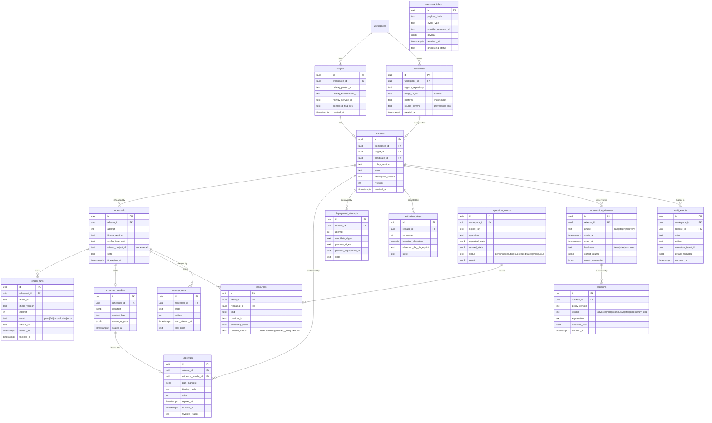

# Data model

Status: Draft v0.1. The M1 subset is marked **[M1]**; the rest lands in later milestones.

## Principles
1. **Every row belongs to a workspace.** Foreign keys are composite `(workspace_id, id)`, so the database itself rejects cross-workspace references.
2. **Facts are immutable, state is explicit.** Candidates, sealed evidence, decisions and audit events are never updated. Lifecycle rows carry a `state` plus a `revision` integer for optimistic concurrency.
3. **External reality is recorded, not assumed.** `operation_intents` and `resources` capture what was attempted and what exists.
4. **Uniqueness enforces invariants.** Wherever possible, invariants are unique or partial-unique indexes, not application checks.

## ERD

## Constraints and indexes

| Table | Constraint / index | Invariant it enforces |
|---|---|---|
| `targets` [M1] | `UNIQUE (railway_project_id, railway_environment_id, railway_service_id)` | One target per external service |
| `candidates` [M1] | `UNIQUE (registry_repository, image_digest, platform)`; no UPDATE grant | Artifact identity is immutable |
| `releases` [M1] | `UNIQUE (target_id) WHERE terminal_at IS NULL` | One active release per target |
| `rehearsals` [M1] | `UNIQUE (release_id, attempt)`; `UNIQUE (railway_project_id) WHERE railway_project_id IS NOT NULL` | Attempts are ordered; ephemeral project owned once |
| `check_runs` [M1] | `UNIQUE (rehearsal_id, check_id, attempt)` | Retries are explicit, not overwrites |
| `evidence_bundles` [M1] | `UNIQUE (rehearsal_id)`; trigger blocks UPDATE when `sealed_at IS NOT NULL` | Sealed evidence is immutable |
| `approvals` [M1] | `INDEX (release_id, created_at)`; rows are never deleted | Approval history preserved |
| `deployment_attempts` | `UNIQUE (release_id, attempt)` | Dark deploy retries are explicit |
| `activation_steps` | `UNIQUE (release_id, sequence)` | Exposure steps ordered |
| `observation_windows` | `UNIQUE (release_id, phase, starts_at)`; `INDEX (release_id, starts_at)` | No overlapping duplicate windows |
| `decisions` | Append-only (no UPDATE or DELETE grant) | Explanations cannot be rewritten |
| `operation_intents` [M1] | `UNIQUE (workspace_id, logical_key)` | Idempotent intent creation |
| `resources` [M1] | `UNIQUE (provider_id) WHERE provider_id IS NOT NULL`; `UNIQUE (ownership_name)` | No double-owned provider resource |
| `cleanup_runs` [M1] | `UNIQUE (rehearsal_id) WHERE state NOT IN ('verified_gone','abandoned')` | One active cleanup per rehearsal |
| `webhook_inbox` | `UNIQUE (payload_hash)`; `INDEX (processing_status, received_at)`; 30-day retention | Duplicate deliveries deduplicated |
| `audit_events` [M1] | Append-only; `INDEX (release_id, occurred_at)` | Tamper-evident history |

## Canonical hashes
- `evidence_bundles.content_hash` = SHA-256 over the RFC 8785 canonical JSON of the manifest (check results, fixture version, config fingerprint, candidate digest, coverage gaps).
- `approvals.binding_hash` = SHA-256 over the canonical plan manifest (RFC-0001 §5.4).
- `config_fingerprint` = SHA-256 over the canonical, **secret-free** service configuration. Variable *names* are included; values are only included for an allowlist of non-secret keys.

## Open points
- Store raw probe artifacts (logs, HAR files) in a Railway bucket and reference them via `artifact_ref`, or inline them? Default: bucket plus hash.
- Retention for `observation_windows.metric_summaries` once telemetry volume is measured.
