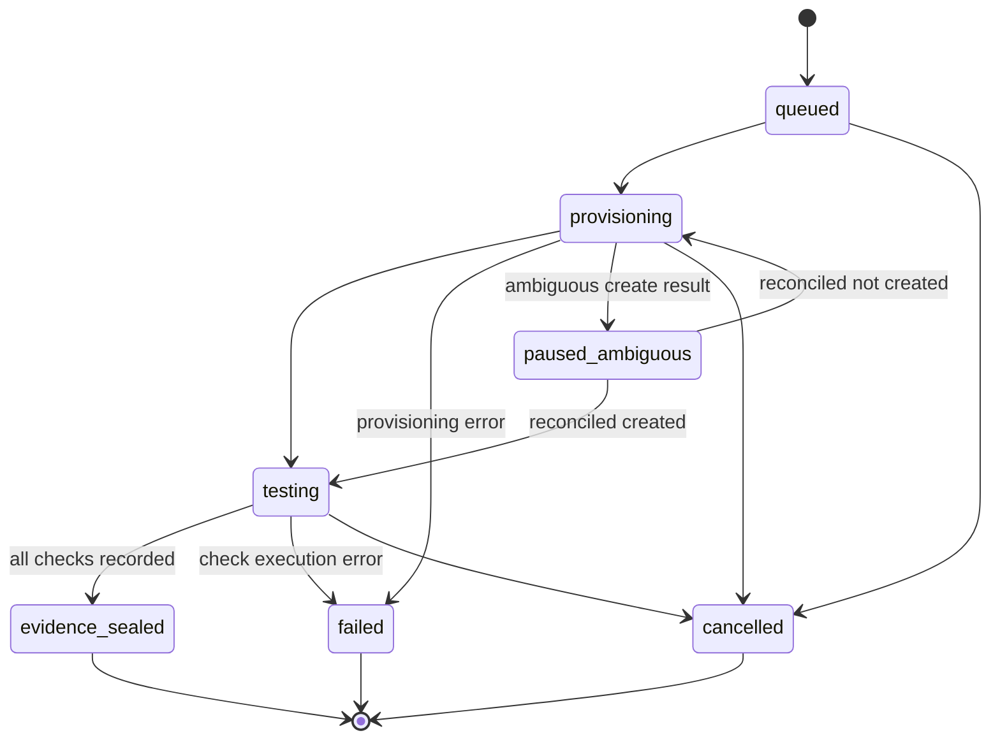
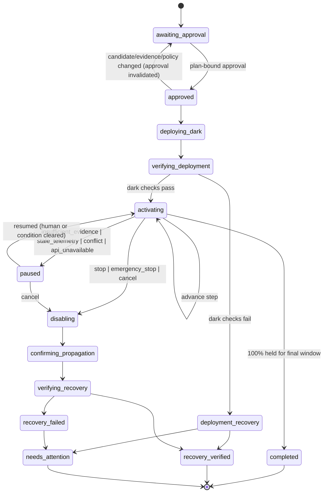
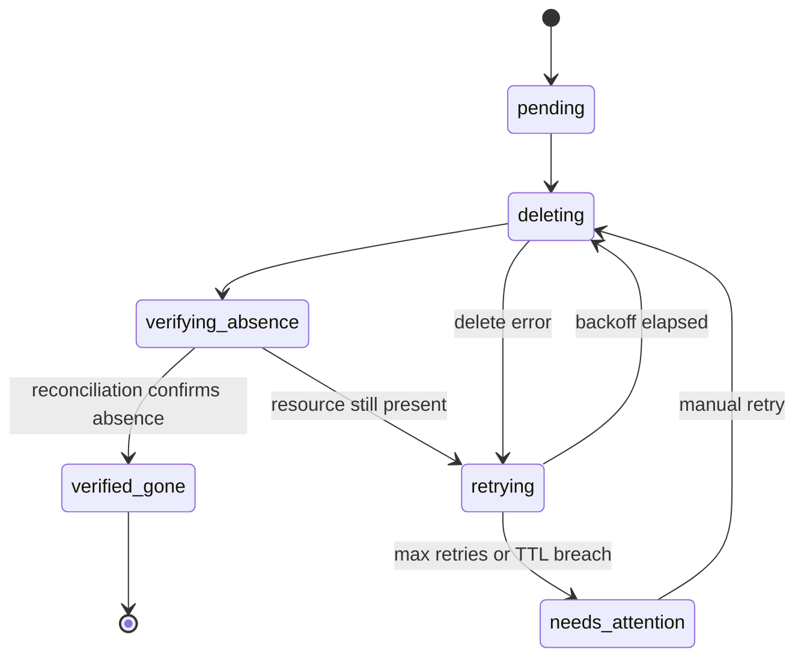

# State machines

Three independent lifecycles. A failure or cancellation in one never silently ends another. Transitions are implemented as pure functions in `packages/domain` and exhaustively unit-tested.

## Rehearsal

Every terminal rehearsal state spawns a cleanup run. `evidence_sealed` may contain failed checks: sealing records what happened, and approval policy decides whether it is acceptable.

## Release

Rules:
- `paused` always stores the phase, the reason and the intended recovery action.
- `cancel` during `activating` or `paused` routes through `disabling`. It is never a direct terminal transition.
- Emergency disable is permitted even when the promotion approval has been invalidated (see the plan's `permitted_recovery_actions`).
- `recovery_failed` means the flag is off and propagation is confirmed, but the metric did not recover. The UI must not claim resolution.

## Cleanup

Cleanup runs under its own Temporal workflow ID derived from the rehearsal ID. Release cancellation, rehearsal failure or a controller restart cannot cancel it. A janitor schedule also sweeps `resources` for rows past their TTL that are not `verified_gone`.
